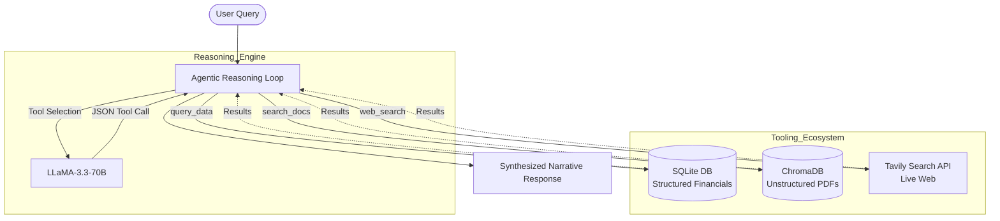

# Agentic RAG System: Financial Intelligence Engine

An advanced, autonomous LLM Agent that performs multi-step financial reasoning by orchestrating structured SQL data, unstructured vector search (RAG), and live web intelligence.

## 1. Architectural Overview

Unlike standard RAG pipelines, this system implements a **Native ReAct (Reasoning and Acting) loop**. It bypasses rigid wrappers to provide a transparent, high-performance execution layer directly between the LLM and the Python runtime.



### Core Engine

- **LLM**: LLaMA-3.3-70B-Versatile (via Groq) for high-reasoning tool selection.
- **Reasoning Pattern**: Native Tool-Calling with a strict 8-step safety circuit breaker.
- **Self-Healing**: Implements an automated correction loop that catches API validation/JSON errors and instructs the LLM to re-align its parameters in real-time.

---

## 2. Tech Stack

- **Structured Data**: `sqlite3` + `pandas` (Deterministic financial metric retrieval).
- **Unstructured Data**: `chromadb` (Vector Store) for semantic search over PDF annual reports.
- **Live Intelligence**: `tavily-python` for real-time stock prices and sector news.
- **Numerical Integrity**: Custom **Regex Anchoring** to ensure live stock prices are extracted deterministically without LLM hallucination.

---

## 3. Tool Contracts

1. **query_data**:
   - **Action**: Executes dynamically generated SQL against the `financials` table.
   - **Guardrail**: System Prompt enforces schema-awareness and cross-entity selection rules.

2. **search_docs**:
   - **Action**: Semantic retrieval of qualitative management commentary from PDF documents.
   - **Output**: Returns relevant chunks with precise source and page citations.

3. **web_search**:
   - **Action**: Real-time web fetch with query-enhancement logic.
   - **Optimization**: Differentiates between "Price" queries (strict regex) and "Narrative" queries (1,000-character context window).

---

## 4. Evaluation & Robustness

The system includes a rigorous evaluation suite (`evaluate.py`) consisting of 20 complex test cases.

- **Deterministic Validation**: Ensures exact numbers (e.g., EPS, Revenue) match database records.
- **Constraint Testing**: Proves the agent rejects out-of-domain queries (e.g., general trivia).
- **Resiliency Testing**: Validates the "Self-Healing" loop by simulating malformed JSON inputs and verifying the agent's ability to recover.

---

## 5. Execution Trace Logging

Every response provides a transparent "Thought Trace" to audit the agent's decision-making process:

```text
Question: What was Infosys' operating margin in FY24?
Step 1: tool=query_data input={'sql_query': 'SELECT operating_margin FROM financials WHERE company = "Infosys" AND year = 2024'} result=[{'operating_margin': 20.7}]
Final Answer: Infosys' operating margin for FY24 was 20.7%.
Citations: financials.db
Steps used: 1 / 8 max
```

---

## 6. Setup Instructions

### 1. Install Dependencies

```bash
pip install -r requirements.txt
```

### 2. Configuration

Create a `.env` file in the root directory:

```env
GROQ_API_KEY=your_key_here
TAVILY_API_KEY=your_key_here
```

### 3. Execution

```bash
python main.py     # Launch the interactive agent
python evaluate.py # Run the 20-case evaluation suite
```
