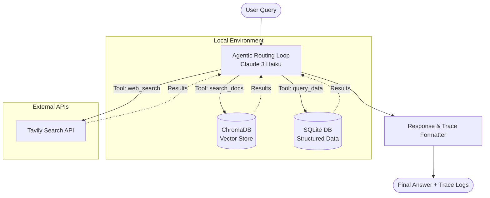

# Agentic RAG System

An intelligent LLM Agent that answers complex questions by combining structured financial data, unstructured document text, and real-time web search.

## Overview

This project implements a multi-tool agent capable of reasoning over mixed datasets (SQL, PDF, and live Web). The agent evaluates the user's query, routes it to the correct tool, and repeats this process until a full answer is deduced—or gracefully refuses to answer if it hits the strict 8-step safety limit.

## Tech Stack & Architecture



- **Agent LLM**: Anthropic Claude 3 (claude-3-haiku-20240307) via the official API for complex tool routing and reasoning.
- **Structured Data**: `sqlite3` and `pandas` for strict SQL lookups against tabular financial metrics (`financials.db`).
- **Unstructured Data**: `chromadb` (local vector database) with default sentence-transformer embeddings to securely query chunked PDF management reports offline.
- **Web Search**: `tavily-python` API for real-time news retrieval.
- **Agent Loop**: A pure Python `while` loop (under 100 lines) implementing a ReAct-style pattern, handling function call parsing seamlessly without relying on black-box wrappers like LangChain.

## Tool Contracts

The agent has three strictly defined tools:

1. **search_docs**:
   - **Purpose**: Semantic search over unstructured management commentary documents.
   - **Input**: Natural language query string.
   - **Output**: Top 3 relevant text chunks with source filename and page numbers.
2. **query_data**:
   - **Purpose**: Query the structured financial / stats table (`financials` table).
   - **Input**: A valid SQL query string.
   - **Output**: A table JSON with column names and row count.
3. **web_search**:
   - **Purpose**: Search the live web for recent information.
   - **Input**: A short search query string (under 10 words).
   - **Output**: Top 3 result snippets with URL and publication date.

## Execution Trace Logging

Every query triggers a strict execution trace designed to evaluate the agent's logic exactly as requested:

- Question: [user question]
- Step X: tool=[tool_name] input=[input_args] result=[truncated output]
- Final Answer: [composed answer]
- Citations: [list of tools invoked]
- Steps used: X / 8 max

## Setup Instructions

1. **Clone the repo & setup environment**:

   ```bash
   python -m venv .venv
   .\.venv\Scripts\activate
   pip install -r requirements.txt
   ```

2. **Keys & Configuration**:
   Create a `.env` file in the root directory (never committed to git) with the following:

   ```env
   ANTHROPIC_API_KEY=your_anthropic_api_key_here
   TAVILY_API_KEY=your_tavily_api_key_here
   ```

3. **Run the Agent**:
   ```bash
   python main.py
   ```
   _(The app will automatically parse PDFs into ChromaDB and load CSVs into SQLite on the first run)._

## Evaluation Checklist

- [x] Runs successfully after one setup command.
- [x] No API keys or secrets in the git history.
- [x] Hard cap of 8 tool calls is enforced in the agent loop.
- [x] Tool definitions precisely match the LLM requirements.
- [x] Trace output format strictly corresponds to the requested layout.
